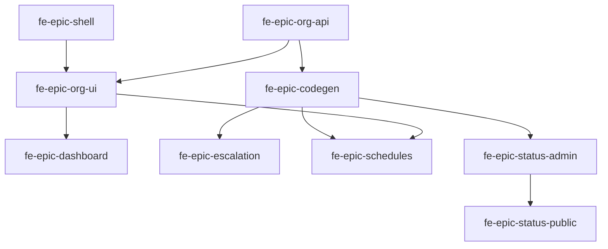

# Frontend refactor plan

> **Machine-readable source of truth:** [`frontend-refactor-plan.yaml`](./frontend-refactor-plan.yaml)  
> **Gap analysis input:** [`frontend-gap-analysis.md`](./frontend-gap-analysis.md)  
> **Phasical import:** `python docs/import-frontend-refactor-plan.py --dry-run` then `--apply` (requires `PHASICAL_API_KEY`)

This plan replaces the completed MVP git roadmap (`docs/roadmap/roadmap.yaml` removed). MVP work lives in **Phasical** + GitHub issues. This document is the active backlog for turning the web operator console and status-page admin from scaffold → product.

---

## Goals

When this plan is complete, a self-hosted operator can:

1. Navigate a **sidebar-based** admin shell (not header tabs) with all configuration surfaces discoverable.
2. Manage **teams, users, services, schedules, escalation policies, heartbeats, integrations, and notification rules** without API/DB workarounds.
3. Configure and publish **status pages** from `apps/web` and see them on `apps/status-page`.
4. Use a **real dashboard** (open alerts + on-call widget) instead of placeholder copy.
5. Meet Outline spec **05 — UI / Design System** baseline: i18n, toasts, skeletons, dark default, COSS particles.

---

## Summary

| Metric | Count |
| ------ | ----: |
| Epics | 17 |
| Leaf tasks | 74 |
| API-only leaves | 9 |
| Web leaves | 42 |
| Shared (ui/codegen) leaves | 6 |
| Status-page leaves | 2 |
| Infra/CI leaves | 2 |

---

## Key product decision: sidebar navigation

**Replace** the current horizontal header nav in `app-shell.tsx` with:

| Viewport | Pattern |
| -------- | ------- |
| Desktop (`md+`) | Persistent left sidebar (COSS `Frame` + `ScrollArea`, particle **p-frame-3**) |
| Mobile | Hamburger → left **Drawer** (**p-drawer-11**) |

### Sidebar sections (initial)

| Section | Items |
| ------- | ----- |
| **Operations** | Dashboard, Alerts, Incidents |
| **Configuration** | Services, Schedules, Teams, Integrations, Status pages |
| **Insights** | Analytics |
| **Admin** (role-gated) | Users, Audit log |
| **Settings** | Settings (SAML, SCIM, Slack, devices, notification prefs) |

Footer: org switcher + user menu (email, **logout**).

Epic: **`fe-epic-shell`** — do this **first** (parallel with API foundation) so all new routes land in the final shell.

---

## Epics overview

| Order | Epic ID | Title | Leaves | Primary scope |
| ----: | ------- | ----- | -----: | ------------- |
| 1 | `fe-epic-shell` | App shell — sidebar navigation | 6 | web |
| 2 | `fe-epic-org-api` | Org structure GraphQL API | 7 | api |
| 3 | `fe-epic-codegen` | GraphQL codegen catch-up | 8 | shared |
| 4 | `fe-epic-org-ui` | Teams & users admin UI | 3 | web |
| 5 | `fe-epic-dashboard` | Dashboard & on-call widget | 3 | web + shared |
| 6 | `fe-epic-alerts` | Alerts UI completion | 3 | web + shared |
| 7 | `fe-epic-escalation` | Escalation policy editor completion | 4 | web |
| 8 | `fe-epic-schedules` | Schedules & on-call management | 6 | web |
| 9 | `fe-epic-services` | Service configuration completion | 3 | web |
| 10 | `fe-epic-integrations` | Integrations UI completion | 4 | web |
| 11 | `fe-epic-notifications` | User notification preferences | 2 | web |
| 12 | `fe-epic-incidents` | Incidents UI completion | 4 | web |
| 13 | `fe-epic-status-admin` | Status page admin (`apps/web`) | 4 | web |
| 14 | `fe-epic-status-public` | Status page public polish + email worker | 5 | api + status-page |
| 15 | `fe-epic-settings-analytics` | Settings, auth, analytics | 5 | web |
| 16 | `fe-epic-polish` | Design system & UX polish | 4 | web + shared |
| 17 | `fe-epic-e2e` | E2E coverage expansion | 3 | ci |

---

## Implementation order (critical path)



**Parallel tracks after shell:**

1. **Track A (foundation):** `fe-epic-org-api` → `fe-epic-codegen` → `fe-epic-org-ui`
2. **Track B (shell polish):** `fe-epic-shell` remaining leaves + `fe-epic-polish` (can interleave)
3. **Track C (features):** dashboard, alerts, escalation, schedules, services, integrations, notifications — after codegen + org UI where needed
4. **Track D (status):** `fe-epic-status-admin` after codegen; public polish + email worker in parallel
5. **Track E (quality):** `fe-epic-e2e` last per flow

---

## Phasical / API import

Phasical is **Kaneo-based**. API paths and request shapes follow the [Kaneo API reference](https://kaneo.app/docs/api-reference/introduction); Escalite's instance is at **`https://phasical.mdg-labs.dev/api`**.

| Operation | Method | Path |
| --------- | ------ | ---- |
| List tasks | GET | `/task/tasks/{projectId}` |
| Create task | POST | `/task/{projectId}` |
| Update status | PUT | `/task/status/{id}` |
| Update description | PUT | `/task/description/{id}` |
| Create relation | POST | `/task-relation` |
| Attach label | POST | `/label` |

Auth: `Authorization: Bearer <PHASICAL_API_KEY>`

### Prerequisites

- Phasical project: **Escalite** (`bkbnmftqdr54r9gcgrgtndbw`)
- Ephemeral API key with task create permissions
- Python 3 + PyYAML (`pip install pyyaml`)

### Commands

```bash
export PHASICAL_API_KEY='...'                              # operator provides ephemeral key
export PHASICAL_BASE_URL='https://phasical.mdg-labs.dev'   # optional; paths use /api/*

python docs/import-frontend-refactor-plan.py --dry-run
python docs/import-frontend-refactor-plan.py --apply

# Single epic (incremental import):
python docs/import-frontend-refactor-plan.py --apply --epic fe-epic-shell
```

### Import behaviour

| Step | Action |
| ---- | ------ |
| Idempotency | Skips tasks containing `**Plan ID: fe-…**` in description |
| Parent | One Phasical task per `fe-epic-*` (marker `**Plan ID: epic:fe-epic-…**`) |
| Children | `POST /task-relation` → `subtask` (epic → leaf) |
| Dependencies | `depends_on` in YAML → `blocks` relation |
| Status | All tasks set to **`ready`** after create |
| Assignee | `PHASICAL_USER_ID` env, or session user, or default operator |
| Labels | Epics: `epic` + `frontend-refactor`; leaves: `frontend-refactor` + scope labels from YAML |

### Manual intake alternative

Use `.agents/skills/phasical-intake/SKILL.md` — paste epic sections from YAML; each leaf already has acceptance criteria, files, and tests formatted for the leaf template.

### Labels

Attach Phasical label **`frontend-refactor`** to all leaves; epics also get **`epic`**. Per-task scope in YAML (`api`, `web`, `shared`, `status-page`) maps to commit scopes in `01-git-workflow.mdc`.

### Task descriptions

Each imported task description includes:

1. **Plan ID** (idempotency marker)
2. **Gap analysis context** — which audit section this epic addresses
3. **Source of truth (Outline)** — doc ids + `docs/specs/` pointers; agents must `fetch` via Outline MCP before implementing
4. **Acceptance criteria**, **files**, **tests**, optional **implementation notes**

Outline registry and per-epic doc mapping live in `frontend-refactor-plan.yaml` (`outline`, `epic_outline_refs`).

---

## Gap analysis coverage matrix

Every section in [`frontend-gap-analysis.md`](./frontend-gap-analysis.md) maps to plan tasks below. **Out of scope** items are explicitly listed.

### Executive / structural gaps

| Gap analysis item | Plan task(s) | Status |
| ----------------- | ------------ | ------ |
| Teams management missing (API + UI) | `fe-api-teams-crud`, `fe-api-team-memberships`, `fe-ui-teams-list`, `fe-ui-team-detail-members` | Covered |
| User directory / invite / notification prefs | `fe-api-users-directory`, `fe-api-user-invite-role`, `fe-ui-users-list-invite`, `fe-ui-contact-methods`, `fe-ui-notification-rules` | Covered |
| Status page admin 0% | `fe-epic-status-admin` (3 leaves) + `fe-codegen-status-page` | Covered |
| Escalation editor empty options | `fe-api-escalation-policy-targets`, `fe-ui-escalation-wire-pickers` | Covered |
| Heartbeat monitors missing | `fe-codegen-heartbeat`, `fe-ui-service-heartbeat-tab` | Covered |
| Schedule/rotation setup partial | `fe-epic-schedules` (6 leaves) + `fe-codegen-schedules-rotations` | Covered |
| Dashboard placeholder | `fe-epic-dashboard` | Covered |
| Integrations Service UUID input / duplicate route | `fe-ui-integrations-service-picker`, `fe-ui-integrations-route-consolidate` | Covered |
| Header nav → **sidebar** (user request) | `fe-epic-shell` | Covered |
| ts-types codegen gap (17 mutations) | `fe-epic-codegen` | Covered |

### Route / feature gaps

| Gap analysis area | Plan task(s) |
| ----------------- | ------------ |
| Alerts ~60% (snooze, service link, escalation state) | `fe-ui-alerts-snooze-reescalate`, `fe-ui-alerts-detail-polish`, `fe-domain-alert-card` |
| Incidents ~55% (create, roles admin, unassign, status publish) | `fe-epic-incidents` |
| Services ~70% (heartbeat tab, team reassign, escalation list) | `fe-epic-services` |
| Escalation partial (delete, repeat, shell) | `fe-epic-escalation` |
| Schedules ~35% (index, CRUD, iCal, labels, subscription) | `fe-epic-schedules` |
| Integrations ~40% (presets, schema forms) | `fe-epic-integrations` |
| Notifications ~10% | `fe-epic-notifications` |
| Analytics ~50% | `fe-ui-analytics-settings` |
| Settings ~60% (org profile, Slack OAuth) | `fe-api-organization-update`, `fe-ui-org-profile-settings`, `fe-ui-settings-section-nav`, `fe-ui-slack-oauth-install` |
| Auth ~70% (password reset, logout) | `fe-api-password-reset`, `fe-ui-auth-password-reset`, `fe-shell-user-menu-logout` |
| Design system / UX polish | `fe-epic-polish` |
| UX anti-patterns (404, breadcrumbs, orphaned escalation route) | `fe-shell-not-found-page`, `fe-shell-breadcrumbs`, `fe-ui-escalation-integrate-shell` |
| Public status page ~80% | `fe-epic-status-public` |
| Subscribe email not sent | `fe-api-status-subscribe-email` |
| Unsubscribe flow missing | `fe-ui-status-public-unsubscribe` |
| E2E beyond alert flow | `fe-epic-e2e` |
| `OnCallWidget` / `AlertCard` missing | `fe-domain-oncall-widget`, `fe-domain-alert-card` |
| `onCallUpdated` unused | `fe-ui-dashboard-oncall-subscription`, `fe-ui-schedule-oncall-subscription` |
| `notification-channel-form.ts` unused | `fe-ui-integrations-schema-config` |
| Hardcoded English ~40% | `fe-ui-i18n-sweep` |
| No toasts / skeletons / dark default | `fe-epic-polish` |

### Explicitly out of scope (not in this plan)

| Item | Reason |
| ---- | ------ |
| Command palette | Post-MVP per spec 05 |
| Teams outbound integration UI | Slack-first; spec defers Teams |
| Jira/ServiceNow outbound UI | Optional Phase 5; not blocking operator console |
| Session management UI | No API spec yet — add follow-up if needed |
| Mobile app changes | Separate `apps/mobile` backlog |
| Slack channel-per-incident / interactive buttons | Backend-heavy Phase 3; only `fe-ui-slack-oauth-install` for workspace token |

### Coverage verification

- [x] All 15 gap-analysis feature sections mapped
- [x] All API-without-UI operations from gap analysis assigned to codegen + UI leaves
- [x] All missing GraphQL capabilities have API leaves in `fe-epic-org-api` (incl. org profile)
- [x] Sidebar navigation requirement captured as first epic
- [x] Status page public + admin split across two epics
- [x] Spec 05 domain components (`OnCallWidget`, `AlertCard`, `EscalationPolicyEditor`, `ScheduleCalendar`) — editor/calendar exist; widget/card tasked

### Round 2 verification (2026-07-27)

Second pass against [`frontend-gap-analysis.md`](./frontend-gap-analysis.md) after import-script fix:

| Finding | Action |
| ------- | ------ |
| Import script used wrong REST paths (`/api/v1/…`) | Rewritten for Kaneo API at `https://phasical.mdg-labs.dev/api` |
| `ready_status` was `to-do` | Fixed to `ready` (Escalite board column slug) |
| Org rename mutation missing from API plan | Added `fe-api-organization-update`; `fe-ui-org-profile-settings` depends on it |
| Duplicate `/integrations` inferior to service tab | Added `fe-ui-integrations-route-consolidate` |
| Settings is one long page without section nav | Added `fe-ui-settings-section-nav` |
| Public status unsubscribe flow missing | Added `fe-ui-status-public-unsubscribe` |
| Session management UI | Remains **out of scope** (no API spec) |
| Password reset API may not exist yet | `fe-api-password-reset` leaf explicitly adds schema + handlers |

**Plan totals after round 2:** 17 epics, **73** leaf tasks.

### Round 3 verification (pre-import, 2026-07-27)

Final compare against gap analysis before `--apply`:

| Gap analysis item | Plan coverage | Notes |
| ----------------- | ------------- | ----- |
| All 15 feature sections | Covered | Each epic maps via `epic_gap_sections` in YAML |
| Status admin: view subscriptions | `fe-ui-status-page-subscriptions` | **Added** this round |
| Status admin: preview URL | `fe-ui-status-page-settings` | Preview link in acceptance criteria |
| Status admin: post updates / resolve | `fe-ui-status-page-incident-admin` | createStatusPageIncidentUpdate + resolve |
| Alert notification attempts | `fe-ui-alerts-detail-polish` | Read-only summary in AC |
| Auto component status from `serviceId` | Deferred | Post-MVP polish; not blocking operator console |
| Status-page COSS particle alignment | Deferred | Low; `Frame` works; optional follow-up |
| `resolvedAt` on public timeline | Partial | `fe-ui-status-public-resolved-history` covers resolved section |
| Session management UI | Out of scope | No API spec |
| Epic Phasical label | `epic` | Fixed — was incorrectly `frontend-refactor` on epics |
| Outline as source of truth | In every description | Outline doc ids + MCP fetch instruction |

**Plan totals after round 3:** 17 epics, **74** leaf tasks. Ready for `--apply`.

---

## Epic details (human index)

Full acceptance criteria, files, and tests live in YAML. This index is for navigation only.

### `fe-epic-shell` — App shell — sidebar navigation

| Plan ID | Title |
| ------- | ----- |
| `fe-shell-sidebar-layout` | Replace header nav with sidebar app shell |
| `fe-shell-sidebar-mobile-drawer` | Mobile sidebar drawer |
| `fe-shell-nav-config-routes` | Centralize nav config + new route slots |
| `fe-shell-user-menu-logout` | User menu with logout |
| `fe-shell-breadcrumbs` | Breadcrumbs on nested screens |
| `fe-shell-not-found-page` | Dedicated 404 page |

### `fe-epic-org-api` — Org structure GraphQL API

| Plan ID | Title |
| ------- | ----- |
| `fe-api-teams-crud` | Team CRUD mutations |
| `fe-api-team-memberships` | Team membership mutations |
| `fe-api-users-directory` | Organization users query |
| `fe-api-user-invite-role` | Invite user + role assignment |
| `fe-api-organization-update` | Organization profile update mutation |
| `fe-api-password-reset` | Password reset API |
| `fe-api-escalation-policy-targets` | Escalation policy targets in query |

### `fe-epic-codegen` — GraphQL codegen catch-up

| Plan ID | Title |
| ------- | ----- |
| `fe-codegen-heartbeat` | Heartbeat operations |
| `fe-codegen-schedules-rotations` | Schedule/rotation CRUD |
| `fe-codegen-notifications` | Notification channels + rules |
| `fe-codegen-alerts-escalation` | Snooze, re-escalate, delete policy |
| `fe-codegen-incidents-admin` | Incident admin operations |
| `fe-codegen-status-page` | Status page admin operations |
| `fe-codegen-analytics-settings` | Analytics settings |
| `fe-codegen-org-teams-users` | New org structure operations |

### `fe-epic-org-ui` — Teams & users admin UI

| Plan ID | Title |
| ------- | ----- |
| `fe-ui-teams-list` | Teams list + create |
| `fe-ui-team-detail-members` | Team detail + members |
| `fe-ui-users-list-invite` | Users list + invite |

### `fe-epic-dashboard` — Dashboard & on-call widget

| Plan ID | Title |
| ------- | ----- |
| `fe-domain-oncall-widget` | OnCallWidget component |
| `fe-ui-dashboard-page` | Dashboard page |
| `fe-ui-dashboard-oncall-subscription` | onCallUpdated on dashboard |

### `fe-epic-alerts` — Alerts UI completion

| Plan ID | Title |
| ------- | ----- |
| `fe-ui-alerts-snooze-reescalate` | Snooze + re-escalate |
| `fe-ui-alerts-detail-polish` | Escalation state + service link |
| `fe-domain-alert-card` | AlertCard component |

### `fe-epic-escalation` — Escalation policy editor

| Plan ID | Title |
| ------- | ----- |
| `fe-ui-escalation-wire-pickers` | Wire user/schedule pickers |
| `fe-ui-escalation-integrate-shell` | AppShell + breadcrumbs |
| `fe-ui-escalation-delete-policy` | Delete policy |
| `fe-ui-escalation-repeat-settings` | Repeat / max-repeat UI |

### `fe-epic-schedules` — Schedules & on-call management

| Plan ID | Title |
| ------- | ----- |
| `fe-ui-schedules-index` | Schedules list |
| `fe-ui-schedule-create-edit` | Create/edit schedule |
| `fe-ui-rotation-crud` | Rotation CRUD |
| `fe-ui-schedule-user-labels` | User display names |
| `fe-ui-schedule-ical-export` | iCal export |
| `fe-ui-schedule-oncall-subscription` | onCallUpdated on schedule page |

### `fe-epic-services` — Service configuration

| Plan ID | Title |
| ------- | ----- |
| `fe-ui-service-heartbeat-tab` | Heartbeat monitors tab |
| `fe-ui-service-team-reassign` | Change service team |
| `fe-ui-service-escalation-list-polish` | Escalation policies table |

### `fe-epic-integrations` — Integrations UI

| Plan ID | Title |
| ------- | ----- |
| `fe-ui-integrations-service-picker` | Service combobox on /integrations |
| `fe-ui-integrations-route-consolidate` | Consolidate standalone /integrations route |
| `fe-ui-integrations-schema-config` | JSON Schema config forms |
| `fe-ui-integrations-presets` | Additional presets |

### `fe-epic-notifications` — Notification preferences

| Plan ID | Title |
| ------- | ----- |
| `fe-ui-contact-methods` | Contact methods panel |
| `fe-ui-notification-rules` | Per-priority rules editor |

### `fe-epic-incidents` — Incidents UI

| Plan ID | Title |
| ------- | ----- |
| `fe-ui-incident-create` | Create incident |
| `fe-ui-incident-role-definitions-admin` | Role definitions admin |
| `fe-ui-incident-role-unassign` | Unassign role |
| `fe-ui-incident-publish-status-page` | Publish to status page |

### `fe-epic-status-admin` — Status page admin (web)

| Plan ID | Title |
| ------- | ----- |
| `fe-ui-status-page-settings` | Status page settings route |
| `fe-ui-status-page-components` | Component CRUD |
| `fe-ui-status-page-incident-admin` | Public incident updates |
| `fe-ui-status-page-subscriptions` | View email subscriptions (admin) |

### `fe-epic-status-public` — Public status page + worker

| Plan ID | Title |
| ------- | ----- |
| `fe-api-status-subscribe-email` | Subscriber email worker |
| `fe-ui-status-public-resolved-history` | Resolved incidents section |
| `fe-ui-status-public-unsubscribe` | Email unsubscribe flow |
| `fe-ui-status-public-meta` | Dynamic page title/meta |
| `fe-e2e-status-page-public` | Public status page E2E |

### `fe-epic-settings-analytics` — Settings & analytics

| Plan ID | Title |
| ------- | ----- |
| `fe-ui-auth-password-reset` | Password reset pages |
| `fe-ui-settings-section-nav` | Settings page section navigation |
| `fe-ui-org-profile-settings` | Org profile section |
| `fe-ui-analytics-settings` | Analytics maintenance toggle |
| `fe-ui-slack-oauth-install` | Slack OAuth install |

### `fe-epic-polish` — Design system polish

| Plan ID | Title |
| ------- | ----- |
| `fe-ui-i18n-sweep` | i18n remaining strings |
| `fe-ui-toast-mutations` | Toast feedback |
| `fe-ui-skeleton-empty-states` | Skeleton + empty states |
| `fe-ui-dark-mode-default` | Dark mode default |

### `fe-epic-e2e` — E2E expansion

| Plan ID | Title |
| ------- | ----- |
| `fe-e2e-teams-schedules-flow` | Team → schedule → override |
| `fe-e2e-escalation-flow` | Escalation with user target |
| `fe-e2e-status-page-admin-flow` | Admin → public status page |

---

## Agent instructions

- **Do not** consult deleted `docs/roadmap/roadmap.yaml` or `p0-*`…`p5-*` IDs for new work.
- **Do** use `fe-*` plan IDs from this file / YAML when linking commits before Phasical sync (`chore(roadmap)[fe-shell-sidebar-layout]: …` until GitHub `#N` exists).
- **Orchestrator:** import epics in `suggested_order`; respect `depends_on` in YAML.
- **Verifier:** each leaf acceptance criteria in YAML is the PASS/FAIL checklist.
